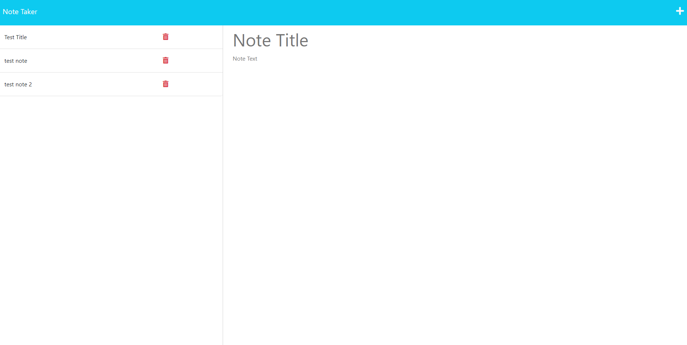

# Note Taker Starter Code

## Description 
The following repository uses expressjs in order to create an interactive webapp which allows users to input there notes and save them onto the dashboard, once they are saved, each not can be access, edited and deleted. 

---
## Contents
- [Description](#description)
- [Installation](#installation)
- [Usage](#usage)
- [Contributing](#contributing)
- [License](#license)
- [Questions](#questions)
- [Demo](#demo)

---
## Installation
The express and unigid packages will need to be installed with npm i 

---
## Usage
the user will be able to add their notes by inputting a title and note body within the dashboard, once this is done, all notes will appear on the left and can be access again and edited. Once a note is no longer required, each note can be deleted. 

---
## Contributing
Michael Bosse

---
## License
No License

---
## Questions
Github - https://github.com/Mbosse97 

---
### Demo

Screenshot of Project Demo

Project Demo Link:  https://fierce-bastion-33851.herokuapp.com/ 